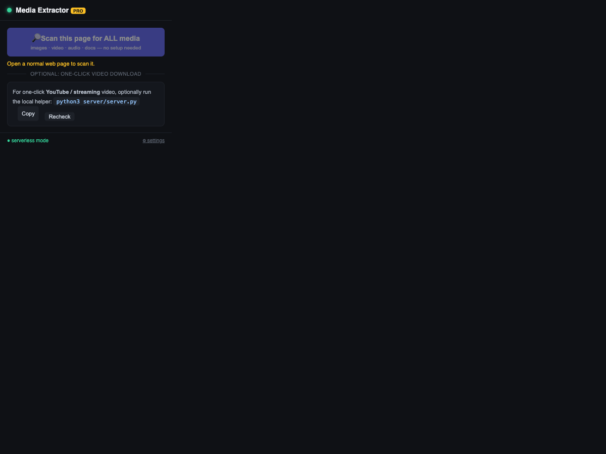
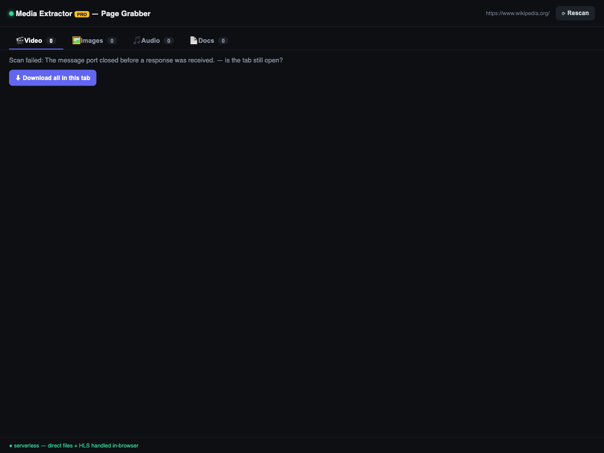
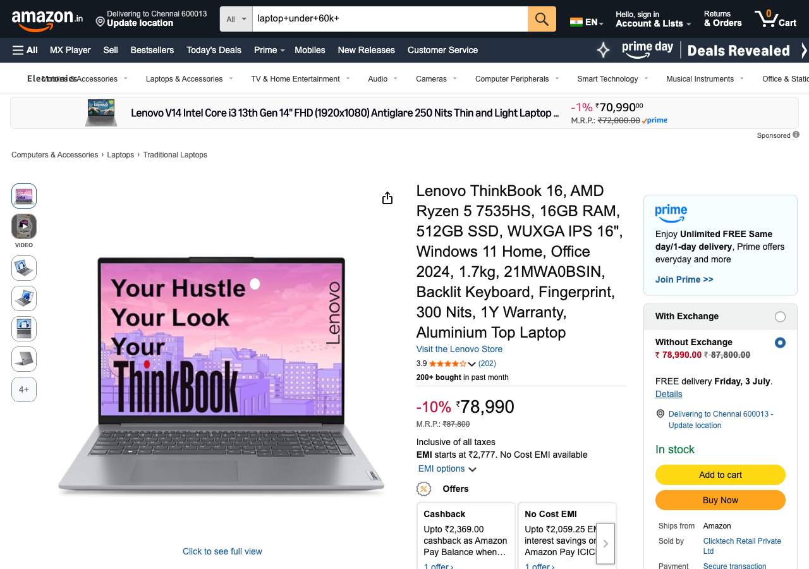
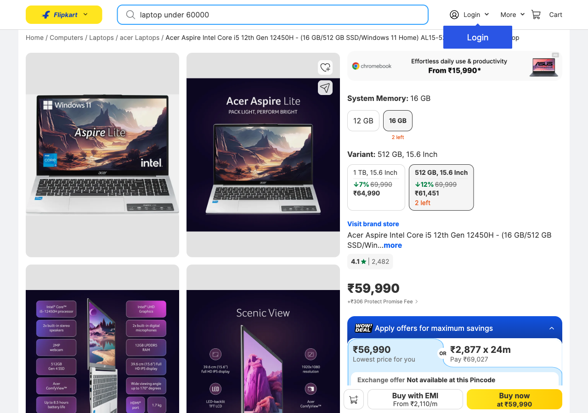

# Media Extractor PRO

Media Extractor PRO is a powerful, production-grade Chrome extension designed to extract, sniff, and download all types of media: **Images, Videos, Audios, and Documents** from any web page. 

It runs in two flexible modes:
1. **Serverless Mode (Default)**: Scrapes high-resolution images, captures direct video/audio files, sniffs HLS stream playlists, parses variants, and executes **multi-threaded parallel chunked downloads** completely inside your browser.
2. **Helper Server Mode (Optional)**: Connects to a local or cloud-hosted Python backend powered by `yt-dlp` and `ffmpeg` to resolve and download signature-protected media from YouTube, Instagram, Dailymotion, Twitter, and ~1800 other sites.

---

## 📷 Screenshots & What to Expect

### 1. The Extension Popup
When clicked on any web page, the popup shows a quick action to launch the serverless page grabber, or resolves one-click streaming downloads if a helper backend is connected.



### 2. The Serverless Page Grabber
The grabber scans the active page (including nested frames, scripts, and dynamic elements) to list all media resources. It includes automatic high-resolution upgrades for Wikimedia, Unsplash, and Pexels.



### 3. Amazon India Product Verification
The extension successfully extracts hidden product video files and high-res product photos from e-commerce sites like Amazon.



### 4. Flipkart E-Commerce Verification
Extracts hundreds of lazy-loaded images, variant crops, and asset files from platforms like Flipkart.



---

## 🚀 How to Install the Extension

1. Download or clone this repository.
2. Open Google Chrome and navigate to `chrome://extensions/`.
3. Enable **Developer mode** using the toggle switch in the top-right corner.
4. Click **Load unpacked** in the top-left corner.
5. Select the `advanced-media-extractor` folder. The extension icon will now appear in your toolbar.

---

## 📖 How to Use

### Mode A: Serverless Mode (Zero Setup)
1. Navigate to any web page (e.g. news sites, blogs, media portals, arXiv).
2. Click the extension toolbar icon.
3. Click **🔎 Scan this page for ALL media**.
4. A full dashboard tab will open listing all found assets:
   - **HLS Streams**: Click the dropdown next to any `.m3u8` stream to parse available resolutions and download.
   - **Direct Video / Audio / Docs**: Downloads automatically run through our **parallel chunked downloader** (4-thread concurrency utilizing HTTP `Range` headers) with real-time progress feedback.

### Mode B: Helper Server Mode (YouTube / Instagram / Protected Streams)
Because platforms like YouTube, Instagram, Dailymotion, and Twitter serve videos in fragmented segments with dynamic signature ciphers, browser extensions cannot scrape or merge them directly on the frontend. 

For these platforms, you connect the extension to a helper server:

#### Option 1: Run it Locally
1. Install requirements (system-wide):
   ```bash
   brew install yt-dlp ffmpeg   # macOS
   # or on Windows/Linux using your package manager
   ```
2. Start the helper server:
   ```bash
   python3 server/server.py
   ```
3. Open the extension popup, click **⚙ settings** at the bottom, make sure it is pointing to `http://127.0.0.1:8787`, and click **Save**.

#### Option 2: Deploy to the Cloud (Railway)
If you cannot run python locally, you can host the backend in the cloud:
1. Log in to [Railway](https://railway.app) and create a **New Project** -> **Deploy from GitHub**.
2. Select your cloned repository.
3. Set the **Root Directory** settings to `server`.
4. Railway will build the app using the provided `Dockerfile` (which automatically installs Python, `ffmpeg`, and `yt-dlp`).
5. Copy your public domain (e.g. `https://your-extractor-backend.up.railway.app`).
6. In the extension popup, click **⚙ settings**, paste your Railway URL, and click **Save**.
7. The extension will now process downloads on your remote server and stream the completed files directly to your local browser!

---

## ⚠️ Important Precautions & Constraints

*   **YouTube, Instagram, Twitter & Protected Streams**: These sites **will not work** in serverless mode. You *must* run or connect the Helper Server (`yt-dlp` backend) to resolve and download them.
*   **Buffered/Dynamic Sites (like Dailymotion)**: In serverless mode, the stream links are sniffed on the fly. You must start playing or load the video player on the page for the browser to trigger the stream requests, allowing the extension's network listener to capture them.
*   **DRM (Digital Rights Management)**: The extension **cannot** download media from DRM-protected platforms like Netflix, Spotify, Prime Video, or Disney+. These streams are hardware-encrypted, and decryption is technically impossible.
